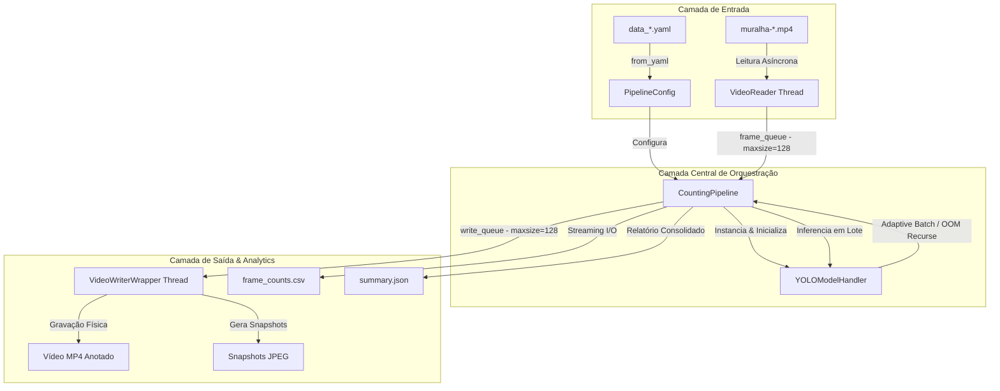
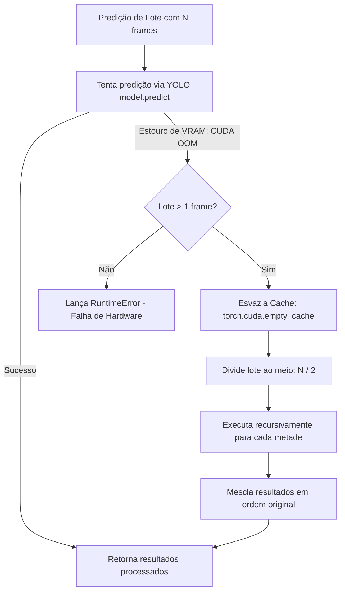

# Guia de Engenharia e Arquitetura de Software - Head Counting Pipeline

Este guia descreve de forma aprofundada as decisões de arquitetura de software, padrões de engenharia e estratégias de infraestrutura adotadas no subprojeto **`app`** da aplicação de detecção e contagem de cabeças humanas. 

Todas as implementações foram estruturadas de forma modular, autocontida, com forte foco em concorrência eficiente, resiliência física de hardware e validação matemática de dados. A aplicação reside de maneira independente no diretório [app](count-github-yolo-01/app).

---

## 1. Visão Geral da Arquitetura e Fluxo de Dados

A arquitetura foi projetada com base nos princípios de **Responsabilidade Única (SRP)**, **Fail-Fast** e **Desacoplamento de Entrada/Saída**. Ela remove gargalos de processamento ao isolar as etapas críticas de decodificação de imagem, inferência de rede neural profunda e gravação/renderização de mídia.

### Diagrama de Fluxo de Dados e Componentes

O fluxo de dados da aplicação funciona de forma contínua através do seguinte arranjo de componentes:



---

## 2. Subsistema de Configuração (Fail-Fast e Tipo-Segurança)

### Problema Resolvido
A versão de referência baseada em notebooks sofria de extrema fragilidade operacional:
1. Chaves de dicionário dinâmicas (`CONFIG.get("some_key")`) eram suscetíveis a erros ortográficos detectados apenas em tempo de execução (*runtime*).
2. O uso de caminhos relativos ao diretório de trabalho atual (CWD) causava falhas caso a execução do script ocorresse a partir de um terminal aberto em outra pasta.
3. Cenários de **falha tardia** (*lazy failure*), em que o pipeline alocava memória da GPU, lia metade do vídeo e abortava abruptamente porque uma pasta de saída não existia ou o caminho de salvamento do CSV estava incorreto.

### Abstração e Implementação
No arquivo [config.py](count-github-yolo-01/app/head_counting/config.py), criamos um design robusto baseado em **Python Dataclasses** estritamente tipadas e aninhadas:
* `AppConfig`, `EnvConfig`, `PathsConfig`, `RuntimeConfig`, `InferenceConfig`, `CountingConfig`, `OutputConfig` e a classe agregadora `PipelineConfig`.

O carregamento é feito através do método `PipelineConfig.from_yaml()`, que executa as seguintes operações essenciais:
1. **Resolução de Caminhos Absolutos**: O pipeline determina a localização física do arquivo YAML carregado (`config_dir`). Todos os caminhos relativos de entrada/saída declarados no arquivo de configuração são automaticamente resolvidos de forma absoluta em relação a esse diretório e não em relação ao terminal.
   ```python
   def to_absolute(val: str) -> str:
       p = Path(val)
       if p.is_absolute():
           return str(p.resolve())
       return str((self.config_dir / p).resolve())
   ```
2. **Design Fail-Fast**: Antes de alocar qualquer recurso do PyTorch ou instanciar o modelo de IA, a classe `VideoReader` valida a existência física do arquivo de vídeo no método `_validate_and_extract_metadata()`. Se o vídeo estiver corrompido ou inacessível, o programa aborta imediatamente com erro claro (`FileNotFoundError` / `RuntimeError`), poupando recursos do sistema.

### Layout e Finalidade dos Blocos de Configuração (YAML)

Os arquivos de configuração ([data_day.yaml](count-github-yolo-01/app/data_day.yaml) e [data_night.yaml](count-github-yolo-01/app/data_night.yaml)) dividem os parâmetros do sistema em blocos semânticos estruturados. Cada seção possui um propósito exclusivo no gerenciamento do ciclo de vida da aplicação:

1. **`app` (Configurações Gerais)**:
   * **Finalidade**: Metadados gerais e reprodutibilidade do projeto.
   * **Campos principais**: `name` (identificador único do cenário para logging e relatórios) e `seed` (semente inteira para operações pseudo-aleatórias consistentes).

2. **`environment` (Variáveis de Ambiente Locais)**:
   * **Finalidade**: Isolamento de cache para evitar poluição no sistema operacional do usuário.
   * **Campos principais**: `YOLO_CONFIG_DIR`, `MPLCONFIGDIR` e `TORCH_HOME`. Ao direcionar estes diretórios para pastas internas (ex: `.yolo`, `.cache`), a aplicação roda de forma autônoma sem interferir em instalações globais de PyTorch ou Ultralytics.

3. **`paths` (Caminhos de Arquivos e Ativos)**:
   * **Finalidade**: Definição das mídias de entrada e endereços físicos para persistência dos resultados.
   * **Campos principais**: `video` (caminho relativo do MP4 de entrada), `weights` (localização dos pesos `.pt` ou `.engine`), `output_dir` (pasta centralizada dos outputs) e as referências geradas para os arquivos `annotated_video`, `frame_counts_csv`, `summary_json` e `snapshots_dir`.

4. **`runtime` (Alocação de Hardware e Precisão CUDA)**:
   * **Finalidade**: Configurar como o PyTorch se conecta e gerencia os recursos físicos da GPU.
   * **Campos principais**: 
     * `require_cuda`: Força o cancelamento imediato caso a placa gráfica falhe em inicializar.
     * `device`: Índice físico da GPU.
     * `batch_size`: Quantidade de frames enviados em paralelo à GPU (ajustado de acordo com a VRAM disponível).
     * `auto_reduce_batch_on_oom`: Lógica de divisão recursiva ativada sob OOM.
     * `allow_tf32` e `torch_float32_matmul_precision`: Nível de precisão e velocidade das operações de multiplicação matricial.

5. **`inference` (Ajustes de Modelo do YOLO)**:
   * **Finalidade**: Controlar a sensibilidade e o comportamento da rede neural profunda.
   * **Campos principais**:
     * `task`: Define a tarefa (ex: `detect` para caixas delimitadoras).
     * `imgsz`: Resolução interna em pixels na qual a rede processa os frames (ex: `1920` para cabeças pequenas distantes).
     * `conf` e `iou`: Limiares de confiança da detecção e supressão de sobreposições redundantes (NMS).
     * `classes`: Filtro de índices do COCO (ex: `[0]` correspondente apenas a pessoas/cabeças).
     * `vid_stride`: Fator de decimação de frames para processamento rápido (skip frames).

6. **`counting` (Definição da Lógica de Contagem)**:
   * **Finalidade**: Definir o método de extração das estatísticas populacionais.
   * **Campos principais**: `count_source` (determina se a contagem se baseia puramente na quantidade de caixas ou em clusters de pose) e `require_keypoints` (validação por pose).

7. **`output` (Configurações de Exportação e Mídia)**:
   * **Finalidade**: Controlar quais mídias e estatísticas finais devem ser escritas, otimizando o I/O do disco.
   * **Campos principais**: 
     * `output_resolution`: Resolução de redimensionamento final do vídeo anotado para reduzir tamanho em disco (ex: `[1280, 720]`).
     * `save_annotated_video` / `save_frame_counts` / `save_summary`: Chaves booleanas de controle de gravação dos outputs.
     * `save_snapshot_every_n_frames`: Frequência de capturas de tela JPEG para auditoria manual rápida de qualidade.

---

## 3. Otimizações de GPU e Aceleração CUDA (RTX Boost)

O pipeline foi projetado para extrair o máximo throughput de inferência de hardware de alta performance (como a NVIDIA RTX 4090), operando com as seguintes configurações de baixo nível no arquivo [model.py](count-github-yolo-01/app/head_counting/model.py):

### Descoberta Dinâmica de Compilação TensorRT
O processamento direto de arquivos PyTorch (`.pt`) possui custos de sobrecarga do interpretador Python e de tradução dinâmica de grafos. Para mitigar isso, o `YOLOModelHandler` implementa uma lógica de priorização:
* Ao buscar os pesos do modelo no método `_resolve_weight_reference()`, o manipulador verifica se existe um arquivo com a extensão `.engine` (TensorRT compilado) equivalente ao `.pt` configurado.
* Havendo o arquivo `.engine`, a aplicação altera automaticamente a referência do modelo para carregar o motor compilado nativo da NVIDIA. Isso permite inferências de baixíssima latência compiladas especificamente para a arquitetura de execução local (Ada Lovelace).

### Flags de Aceleração PyTorch e CUDA
Ao inicializar o runtime de execução (`setup_runtime`), os seguintes ajustes de hardware são definidos:
1. **TensorFloat-32 (TF32)**:
   ```python
   torch.backends.cuda.matmul.allow_tf32 = True
   torch.backends.cudnn.allow_tf32 = True
   ```
   Ativa o uso de Tensor Cores na GPU para executar multiplicações de matrizes com precisão TF32. Isso proporciona velocidades próximas à precisão de meia-precisão (FP16) mantendo a estabilidade numérica e acurácia de FP32.
2. **cuDNN Autotuning Benchmark**:
   ```python
   torch.backends.cudnn.benchmark = True
   ```
   Informa a biblioteca cuDNN para testar diferentes algoritmos internos de convolução matemática e selecionar o algoritmo otimizado mais rápido para o formato de frame fixado (`imgsz: 1920`).
3. **Precisão de Multiplicação de Matriz**:
   ```python
   torch.set_float32_matmul_precision("highest")
   ```
   Garante máxima performance e controle sobre a fidelidade das operações matemáticas de interpolação e normalização de canais de cor dentro do chip gráfico.

---

## 4. Tolerância a Falhas e Resiliência de Memória (Adaptive Batch OOM)

### Problema Resolvido
A inferência de IA em lote (batching) é crucial para maximizar a vazão de frames. Porém, em vídeos de alta densidade populacional monitorados em altas resoluções (1920x1080), variações repentinas no número de caixas candidatas na fase de Non-Maximum Suppression (NMS) ou fragmentações na memória de vídeo (VRAM) podem causar um erro fatal de estouro de memória física: `torch.cuda.OutOfMemoryError`.

### Solução: Algoritmo Adaptativo de Divisão e Conquista
Em vez de abortar o processamento, o método `predict_batch` implementa uma estratégia robusta de tratamento recursivo:



Código de implementação do comportamento resiliente:
```python
try:
    with torch.inference_mode():
        return list(self.model.predict(source=frames, **args))
except torch.cuda.OutOfMemoryError:
    is_oom = True
# ...
if is_oom:
    if not self.config.runtime.auto_reduce_batch_on_oom or len(frames) == 1:
        raise RuntimeError("CUDA Out-Of-Memory detectado mesmo com lote mínimo de 1 frame.")

    torch.cuda.empty_cache()
    midpoint = max(1, len(frames) // 2)
    logger.warning(f"[CUDA OOM] Reduzindo lote de {len(frames)} para {midpoint} devido a estouro de VRAM.")
    return self.predict_batch(frames[:midpoint]) + self.predict_batch(frames[midpoint:])
```

### Por que isso é vital para produção?
Garante que o pipeline possa continuar processando vídeos por longos períodos em servidores autônomos sem supervisão humana constante. Se a placa sofrer fadiga de memória momentânea por conta de um frame de altíssima densidade, ela se reajusta dinamicamente para continuar rodando e retoma o tamanho de lote padrão no lote seguinte.

---

## 5. Padrão Concorrente Multi-threaded Producer-Consumer

### Problema de Bloqueio de I/O (CPU-GPU Mismatch)
O tempo de inferência de uma rede neural em lote na RTX 4090 ocorre na casa dos milissegundos. Se as tarefas de leitura/decodificação de arquivos do disco rígido e de renderização de caixas de texto com gravação compactada (OpenCV VideoWriter) rodassem sequencialmente na mesma thread principal, a GPU ficaria ociosa na maior parte do tempo.

### Solução e Implementação
No arquivo [video.py](count-github-yolo-01/app/head_counting/video.py), criamos duas estruturas de threads independentes coordenadas por filas thread-safe (`queue.Queue`):

1. **Thread Produtora (`VideoReader`)**:
   * Executa em segundo plano isolada em CPU.
   * Abre o arquivo de vídeo e decodifica os frames sequencialmente em memória RAM como matrizes NumPy.
   * Controla a leitura baseada no parâmetro `stride`.
   * Envia os frames decodificados para a fila concorrente `frame_queue` (limite máximo de capacidade = 128 frames).
2. **Thread Consumidora Principal (`CountingPipeline.run`)**:
   * Consome os frames brutos acumulados na `frame_queue`.
   * Agrupa os frames no tamanho configurado de lote (batch size) e envia direto para a GPU processar.
   * Coleta as predições e encaminha os resultados e imagens para a fila concorrente `write_queue` (capacidade = 128).
3. **Thread Gravadora / Renderizadora (`VideoWriterWrapper`)**:
   * Consome tarefas da `write_queue` de forma assíncrona.
   * Desenha os contornos de detecção, textos estilizados, informações de carimbo de tempo e frame.
   * Altera a resolução física final (`output_resolution`) e comprime a mídia utilizando codecs eficientes (`fourcc`).
   * Salva instantâneos (snapshots) no disco de forma paralela.

### Controle de Retropressão (*Backpressure*)
A definição de um tamanho fixo máximo (`maxsize=128`) para ambas as filas previne o consumo desenfreado de memória RAM do sistema. Se o gravador de vídeo (I/O lento de gravação em disco) começar a atrasar em relação à inferência da GPU (I/O rápido), a `write_queue` enche. Assim que atinge o limite de 128 posições, a thread principal de GPU é colocada em estado de espera (*block*), impedindo o acúmulo infinito de matrizes brutas de alta resolução na RAM da máquina.

---

## 6. Métricas Científicas e Tomada de Decisão Operacional

A consolidação de contagens em vídeo digital produz ruídos estatísticos inerentes devido a oclusões breves ou variações na iluminação. Para contornar isso, a lógica contida em [pipeline.py](count-github-yolo-01/app/head_counting/pipeline.py) extrai cinco indicadores vitais de multidão:

### Definições Matemáticas e Casos de Uso

1. **Média (Mean)**:
   $$\bar{C} = \frac{1}{N} \sum_{i=1}^N C_i$$
   Mapeia o tráfego acumulado geral da cena monitorada. É utilizada para estudos operacionais de longo prazo, como desgaste de pisos, cálculo de tráfego agregado diário e custos operacionais fixos.
2. **Mediana (Median)**:
   $$\text{Mediana} = \text{Valor central da série ordenada de contagens}$$
   Identifica o fluxo típico de pedestres sem sofrer influência de distorções pontuais de multidões temporárias. É estatisticamente robusta contra falhas isoladas de detecção (como frames vazios por oclusão de câmera).
3. **Percentil 95 (P95)**:
   $$P_{95} = \inf \{ c \in \mathbb{R} : F_C(c) \ge 0.95 \}$$
   Onde $F_C(c)$ representa a função de distribuição acumulada da série de contagens de pessoas.
   
   **Por que o P95 é a métrica mais importante da engenharia civil/segurança?**
   * **Contra o pico máximo (Max)**: Projetar a infraestrutura (largura de escadarias, número de catracas, saídas de emergência) baseando-se no limite máximo absoluto (pico máximo) acarreta em custos astronômicos de sobredimensionamento civil para atender a um evento que ocorre em menos de 1% do tempo total.
   * **Contra a média (Mean)**: Projetar a infraestrutura com base na média geraria falhas de tráfego graves (congestionamentos humanos, risco de pisoteamento) em exatamente metade (50%) do período operacional diário.
   * **Decisão P95**: Oferece o equilíbrio financeiro e de engenharia ótimo: garante que a estrutura atenda plenamente e de maneira segura o fluxo humano durante **95% de todo o tempo de funcionamento observado**.

### I/O de Baixa Sobrecarga (Memory-Efficient Logging)
Para garantir que o processamento de vídeos muito longos não sature a memória RAM por guardar o histórico da série temporal de contagens:
* O pipeline escreve os resultados linha por linha de forma direta em disco no formato CSV (`frame_counts.csv`) de maneira contínua através do `csv.DictWriter`.
* Apenas as métricas estáticas e consolidadas de alto nível são calculadas no final e salvas no formato estruturado JSON (`summary.json`).

---

## 7. Estratégia de Testabilidade e Qualidade de Código

A validação das regras de negócio do pipeline é assegurada por testes unitários contidos em [tests](count-github-yolo-01/app/tests):

### Teste do Parser de Configuração
Localizado em [test_config.py](count-github-yolo-01/app/tests/test_config.py), ele assegura que:
* Configurações YAML ausentes disparem exceções apropriadas.
* Configurações válidas sejam parseadas com os tipos corretos.
* Caminhos relativos de mídias e pesos sejam convertidos corretamente para endereços físicos absolutos em disco.

### Teste de Execução Isolada (Mocking de Dependências)
Localizado em [test_pipeline.py](count-github-yolo-01/app/tests/test_pipeline.py), valida toda a orquestração do pipeline de contagem de cabeças sem depender de hardware GPU físico ou da presença de mídias de vídeo reais:
* **Mock do OpenCV**: Simula o comportamento físico de um leitor de mídia (`cv2.VideoCapture`), injetando frames artificiais e simulando de forma controlada o fim do arquivo (EOF).
* **Mock do Ultralytics YOLO**: Substitui a chamada interna do modelo de rede neural, retornando dados controlados de caixas delimitadoras (*bounding boxes*) sintéticas.
* **Resultado**: Garante que o pipeline possa ser verificado de forma instantânea em esteiras automatizadas de Integração Contínua (CI) operando puramente em CPU.

---

## 8. Origem do Modelo e Pesos de Referência (YOLOv8)

A aplicação de contagem de cabeças é baseada em pesos pré-treinados pela comunidade de código aberto, especializados em detecção e contagem densa.

### Especificações do Modelo de IA
* **Arquitetura Base**: Ultralytics YOLOv8 Nano (`yolov8n`).
* **ID do Repositório (Hugging Face Hub)**: [AmineSam/irail-crowd-counting-yolov8n](https://huggingface.co/AmineSam/irail-crowd-counting-yolov8n)
* **Desenvolvedor/Autor**: AmineSam
* **Objetivo de Design**: Detecção e localização de caixas delimitadoras (*bounding boxes*) correspondentes a cabeças humanas em cenários de alta densidade populacional (plataformas de embarque ferroviário, manifestações públicas e vias urbanas congestionadas).

### Como o Modelo foi Aplicado no Pipeline
1. **Configuração de Classes**: O modelo foi originalmente treinado para predição da classe `0` (head/cabeça). No arquivo de configuração do pipeline ([data_day.yaml](count-github-yolo-01/app/data_day.yaml)), filtramos a detecção de forma explícita para essa classe:
   ```yaml
   inference:
     classes:
       - 0
   ```
2. **Integração e Portabilidade**: Os pesos do modelo foram isolados dentro de [weights/best.pt](count-github-yolo-01/app/weights/best.pt) na aplicação, eliminando a dependência de downloads dinâmicos de servidores externos durante o deploy em ambientes fechados de produção.
3. **Conversão para TensorRT (.engine)**: Como a inferência em YOLOv8n consome recursos de CPU no pós-processamento, a aplicação foi otimizada para buscar por arquivos `.engine` gerados localmente pela ferramenta de exportação da Ultralytics (`model.export(format="engine")`). Isso reduz a latência e maximiza o aproveitamento dos núcleos Tensor Cores da NVIDIA RTX 4090.